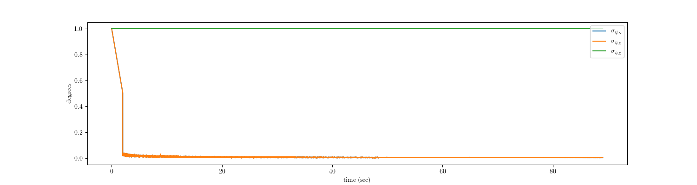

# INS initialization
This repository implements the solution to Inertial Navigation System (INS) initialization. More precisely, the system estimates `roll` and `pitch` angles in addition to accelerometer and gyroscope biases (additionally `yaw` angle if magnetometer data is provided) so as to align the gravity vector direction along the local NED frame. The estimation occurs in two phases: coarse initialization followed by fine initialization. An Extended Kalman Filter (EKF) is used for fine initialization.

For mathematical treatment of the problem, head over to [kvmanohar22.github.io/ins_init](https://kvmanohar22.github.io/ins_init).

## Dependencies
- Eigen 3.2+
- ROS melodic
- numpy (optional)
- matplotlib (optional)
- python3 (optional)

## Usage
I have tested this on Arch Linux and should run out of the box on any Linux based distribution. Feel free to open an issue if faced with any problem.

- Build

```bash
  mkdir -p ins_ws/src
  cd ins_ws/src 
  git clone git@github.com:kvmanohar22/ins_init.git
  cd ..
  catkin_make
```

- Usage

Input to the system is stream of IMU (3 accelerometers, 3 gyroscopes) data. All the data used in this repository has been generated using pixhawk flight controller 2.4.8. Sample data is provided under `assets/imu_*.bag`.

```bash
  roslaunch ins_init test_ins_init_acc.launch
```

The above uses the provided bag under `assets` to estimate the state. To pass in your own bag,

```bash
  roslaunch ins_init test_ins_init_acc.launch bag_path:=/path/to/bag
```
OR

**NOTE**: The sensor has to be kept static during initialization.

if you have live stream of data. You might want to change ROS topic names in `launch/test_ins_init_acc.launch` or pass in on the command line as),

```bash
  roslaunch ins_init test_ins_init_acc.launch imu_topic:=<imu topic>
```

## Experiments
This was done using the data provided under `assets` directory which was collected using pixhawk 2.4.6 flight controller. The method estimates only `roll` and `pitch` angles with input being accelerometer data. Use of velocity observations will yield better results (to be implemented). Following plots show the evolution of covariance and the state (`roll` and `pitch`) itself.

<div class="fig figcenter fighighlight">
  
</div>

<div class="fig figcenter fighighlight">
  
</div>

<div class="fig figcenter fighighlight">
  
</div>

## TODO
- [x] Acceleration observations
- [ ] Velocity observations (which estimates imu biases as well)
- [ ] Estimation of yaw
- [x] Detailed Blog on estimation

