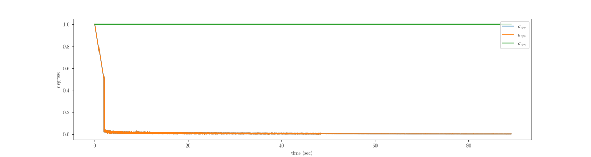
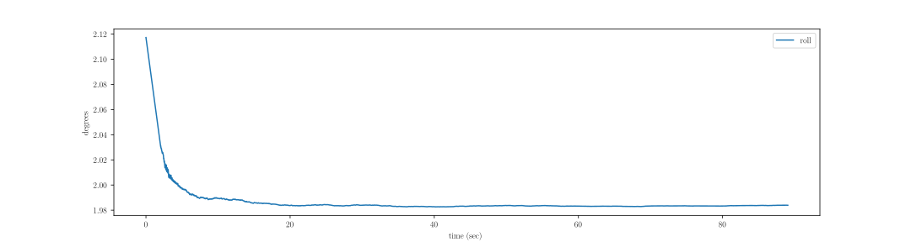
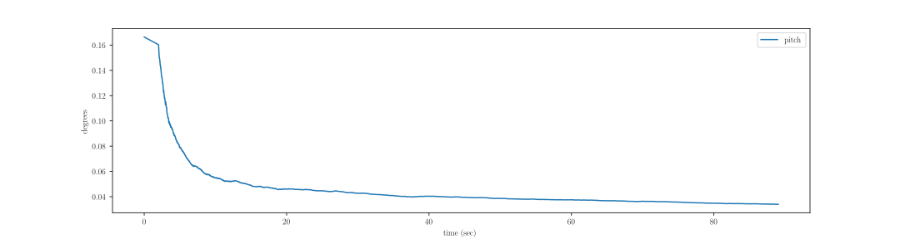

## Contents

- [Motivation](#motivation)
- [Problem Statement](#problem-statement)
- [EKF](#ekf)
- [Solution](#solution)
  - [Coarse Initialization](#coarse-initialization)
  - [Fine Initialization](#fine-initialization)
    - [Acceleration observations](#acceleration-observations)
    - [Velocity observations](#velocity-observations)
- [Experiments](#experiments)
  - [Acceleration observations](#acceleration-observations)
  - [Velocity observations](#velocity-observations)
- [References](#references)

## Motivation
Let's consider a small example of estimating relative orientation between two frames `A` and `B`. Let \\(q(t)\\) be the quaternion that transforms vectors from frame `A` to frame `B`. Differential equation governing the evolution of \\(q\\) is,

$$
\dot q(t) = \frac{1}{2} \Omega(\omega) q(t) \label{}
$$

where \\({\mathbf{\omega}} =\begin{pmatrix} \omega_1 & \omega_2  & \omega_3 \end{pmatrix}^T\\) is angular velocity of frame `B` wrt frame `A`.

$$
\Omega(\omega) = \begin{pmatrix}
0 &  -\omega_1& -\omega_2 & -\omega_3 \\
\omega_1 & 0 & -\omega_3 &  \omega_2\\
\omega_2&  \omega_3& 0 & -\omega_1 \\
\omega_3&  -\omega_2& \omega_1 & 0 
\end{pmatrix}
$$

A second order integration gives,

$$
q(t_{k+1}) = \left(\cos\left(\frac{||\omega||\Delta t}{2}\right)I + \frac{1}{||\omega||} \sin\left(\frac{||\omega||\Delta t}{2}\right) \begin{pmatrix}0 & -\omega^T \\ \omega & -\left[\omega \right]_\times \end{pmatrix}  \right)q(t_k)
$$ 

Clearly to solve this, we require initial condition \\(q(t_0)\\).

This blog and accompanying code presents solution to this problem for the applications in inertial navigation.

## Problem Statement
Inertial sensors (IMUs) used in inertial navigation (GPS based, visual odometry based etc) provide measurements in the  `sensor` frame (from here on `body` frame). Let NED frame be the one in which we are estimating our state. As a consequence, we require to transform measurements to NED frame. If \\({}{\small B}a\\) represents acceleration in the body frame and \\(R_{\small NB} \in SO(3)\\) be the transformation from body frame to NED frame then \\( {}_{\small N}a = R_{\small NB} {}_{\small B}a \\) is the resultant acceleration in NED frame. The problem we are solving is to estimate the initial orientation of `body` frame w.r.t NED frame.

## EKF
Let \\(x(t) \in \mathbb{R}^n\\) be the state vector.

$$
\dot x(t) = A(t)x(t) + G(t)w(t)
$$

where \\(w(t)\\) is a zero-mean, gaussian white noise vector. The above is a non-homogenous linear differential equation. The solution can be obtained as sum of homogenous solution and particular solution.

$$
x(t) = \phi(t, t_0) x(t_0) + \int_{t_0}^{t} \phi(t, t')G(t')w(t') dt'
$$

where \\(\phi(t, t_0)\\) is state transition function. Discretizing the above system gives:

$$
x_{k+1} = \phi(t_{k+1}, t_k) x_k + u_k
$$

where \\(u_k = \int_{t_{k}}^{t_{k+1}} \phi(t, t')G(t')w(t') dt'\\) and this part is stochastic. Mean and covariance are given by:

$$
\begin{align}
\mathbb{E}[u_k]

&= \mathbb{E}\left[\int_{t_{k}}^{t_{k+1}} \phi(t, t')G(t')w(t')\right] dt' \\
&= \int_{t_{k}}^{t_{k+1}} \phi(t, t')G(t') \mathbb{E}[w(t')] dt' \\
                &= 0
\end{align}
$$

$$
\begin{align}
\mathbb{E}[u_k u_k^T]

&= \int_{t_{k}}^{t_{k+1}} \int_{t_{k}}^{t_{k+1}} \phi(t, t')G(t') \mathbb{E}[w(t')w(t'')^T] G(t'')^T \phi(t, t'')^T dt' dt'' \\

&= \int_{t_{k}}^{t_{k+1}} \int_{t_{k}}^{t_{k+1}} \phi(t, t')G(t') Q\delta(t'-t'') G(t'')^T \phi(t, t'')^T dt' dt'' \\

&= \int_{t_{k}}^{t_{k+1}} \phi(t, t')G(t') Q G(t')^T \phi(t, t')^T dt' \\

\end{align}
$$

A first order approximation of the above is given by: \\((\phi(t, t') \approx I + A\Delta t ) \\):

$$
\begin{align}
\mathbb{E}[u_k u_k^T]

&= \int_{t_{k}}^{t_{k+1}} \phi(t, t')G(t') Q G(t')^T \phi(t, t')^T dt' \\

&\approx G_k Q \Delta t G_k^T

\end{align}
$$

Let \\(\hat x_k\\) be an unbiassed estimator of true state \\(x_k\\).So, state evolution is given by:

$$
\begin{align}

\hat x_{k+1}

&= \mathbb{E}[\phi(t_{k+1}, t_k) x_k + u_k] \\
&= \phi(t_{k+1}, t_k) \mathbb{E}[x_k] + \mathbb{E}[u_k] \\
&= \phi(t_{k+1}, t_k) \hat x_k
\end{align}
$$

State Covariance evolution is given by \\(\left(P_k = \mathbb{E}[(\hat x_k-x_k)(\hat x_k-x_k)^T]\right)\\):

$$
\begin{align}

P_{k+1}

&= \mathbb{E}[(\hat x_{k+1}-x_{k+1})(\hat x_{k+1}-x_{k+1})^T] \\
&= \mathbb{E}[(\phi(t_{k+1}, t_k) \hat x_k-\phi(t_{k+1}, t_k) x_k - u_k)(\phi(t_{k+1}, t_k) \hat x_k-\phi(t_{k+1}, t_k) x_k - u_k)^T] \\
&= \mathbb{E}[(\phi(t_{k+1}, t_k) (\hat x_k-x_k) - u_k)(\phi(t_{k+1}, t_k) (\hat x_k-x_k) - u_k)^T] \\
&= \phi(t_{k+1}, t_k) \mathbb{E}[(\hat x_k-x_k)(\hat x_k-x_k)^T] \phi(t_{k+1}, t_k)^T + \mathbb{E}[u_k u_k^T] \\
&= \phi(t_{k+1}, t_k) P_k \phi(t_{k+1}, t_k)^T + G_k Q\Delta t G_k^T \\

\end{align}
$$

## Solution
The estimation occurs in two phases: coarse initialization followed by fine initialization. An Extended Kalman Filter (EKF) is used for fine initialization.

### Coarse Initialization
Let \\(\alpha, \beta, \gamma\\) represent roll, pitch and yaw angles respectively and \\(R_1(\alpha), R_2(\beta), R_3(\gamma)\\) represent rotations about respective axes. If \\(\alpha, \beta, \gamma\\) are the angles of INS relative to local NED frame, we have:

$$
\begin{align}
R_{NB} &= R_3(-\gamma)R_2(-\beta)R_1(-\alpha) \\
R_{BN} &= R_1(-\alpha)^TR_2(-\beta)^TR_3(-\gamma)^T
\end{align}
$$

Substituting the values and after simplification, we get:

$$
_{\small B}a = \begin{pmatrix}
 g \sin(\beta) \\
-g \sin(\alpha) \cos(\beta) \\
-g \cos(\alpha) \cos(\beta)
\end{pmatrix}
$$

From above, we can deduce \\(\alpha, \beta\\) given by:

$$
\begin{align}

\alpha &= \arctan \left(\frac{_{\small B}a_y}{_{\small B}a_z} \right) \\
\beta  &= \arctan \left(\frac{_{\small B}a_x}{\sqrt[]{_{\small B}a_y^2 + {\small B}a_z^2}} \right) \\

\end{align}
$$

We are not estimating \\(\gamma\\) since we do not use magnetometer data.

There are major drawbacks of the above method. First, it assumes no error in the raw accelerometer values which is not the case. Second, there is no estimate of confidence on the estimated value. These will be addressed in the fine initialization step that refines the above estimated values using filtering.

### Fine Initialization
The above problem can be posed as filtering. Two kinds of observations are addressed. First, horizontal accelerations. Second, horizontal velocity components. Each of the methods proceeds by using simplifying assumptions.

#### Acceleration observations
The differential equation governing small angular errors is,

$$
{}_{\small N}\dot{\psi} = -R_{\small{NB}}\cdot {}_{\small B}\delta \omega_{\small{IB}} - {}_{\small N}\omega_{\small{IN}} \times  {}_{\small N}\psi + {}_{\small N}\delta \omega_{\small{IN}}
$$

where \\(I\\) is the inertial frame of reference wrt which IMUs measure. The simplifying assumptions are: no gyroscope error \\(\implies {}_{\small N}\delta \omega_{\small{IN}} = 0, {}_{\small N}\delta \omega_{\small{IB}} = 0 \\), reducing the above equation to:

$$
{}_{\small N}\dot{\psi} = {}_{\small N}\omega_{\small{IN}} \times  {}_{\small N}\psi
$$

$$
_{\small N}\omega_{\small{IN}} = \begin{pmatrix} \omega_e \cos(\phi)& 0 & -\omega_e \sin(\phi)\end{pmatrix}^T
$$

Expressing component-wise, we have

$$
\frac{d}{dt}
\begin{pmatrix}
_{\small N}{\psi_{\small N}} \\
_{\small N}{\psi_{\small E}} \\
_{\small N}{\psi_{\small D}}
\end{pmatrix} = \begin{pmatrix}
0 & -\omega_{\small e} \sin(\phi) & 0 \\
\omega_{\small e} \sin(\phi) & 0 & \omega_{\small e} \cos(\phi) \\
0 & -\omega_{\small e} \cos(\phi) & 0
\end{pmatrix}
\begin{pmatrix}
_{\small N}{\psi_{\small N}} \\
_{\small N}{\psi_{\small E}} \\
_{\small N}{\psi_{\small D}}
\end{pmatrix}
$$

The above is a linear, homogenous 1st order differential equation. And \\( G = 0 \\) because of simplified assumptions. Observations are related to the state via,

$$
{}_{\small N}\delta a = {}_{\small N}a \times {}_{\small N}{\psi} + {}_{\small N}v
$$

where \\( _{\small N}v \\) is white noise (whose components are along NED frame), \\( _{\small N} a = (0, 0, -g)^T \\). This is again linearly related to the states. Expanding the above gives,

$$
\begin{pmatrix}
_{\small N}{\delta a_{\small N}} \\
_{\small N}{\delta a_{\small E}} \\
_{\small N}{\delta a_{\small D}}
\end{pmatrix} = \begin{pmatrix}
0 & -g & 0 \\
g & 0 & 0 \\
0 & 0 & 0
\end{pmatrix}
\begin{pmatrix}
_{\small N}{\psi_{\small N}} \\
_{\small N}{\psi_{\small E}} \\
_{\small N}{\psi_{\small D}}
\end{pmatrix}
+
\begin{pmatrix}
{_{\small N}v_{\small N}} \\
{_{\small N}v_{\small E}} \\
{_{\small N}v_{\small D}}
\end{pmatrix}
$$

Assuming the observations arrive on a continuous basis, the expression for the covariance (Fisher-information) propagation can be obtained as the solution to Riccati equation
 
$$
P^{-1}(t) = \phi(t, t_0) P^{-1}(t_0) \phi(t, t_0)^T + \int_{t0}^{t} \phi(\tau, t) H^T(\tau) R^{-1} H(\tau)  \phi(\tau, t) d\tau
$$

Since \\( \omega_e \approx 10^{-5} \\) and given the fact that initialization time is considerably less compared to a day, we can approximate it to 0 and hence  \\( \phi(t, t_0) = \exp( F (t-t_0)) \approx I_{3 \times 3} \\). Further, \\( H \\) is constant and expressing  \\( R \\) as,

$$

R = \begin{pmatrix}
\sigma_a^2 & 0 & 0 \\
0 & \sigma_a^2 & 0 \\
0 & 0 & \sigma_a^2
\end{pmatrix} \Delta t

$$ 

a closed form solution can be obtained with,

$$
P(t_k) = 
\text{diag}
\left(
\begin{matrix}
\frac{\sigma_a^2}{kg^2} \frac{1}{1 + \frac{\sigma_a^2}{kg^2}\frac{1}{\sigma_N^2}} &
\frac{\sigma_a^2}{kg^2} \frac{1}{1 + \frac{\sigma_a^2}{kg^2}\frac{1}{\sigma_E^2}} & 
\sigma_D^2
\end{matrix}
\right)
$$ 

where \\( t_k = t_0 + k \Delta t \\).

Some interesting observations are, 
- The variance of yaw remains constant (equal to initial variance).
- Variance in roll and pitch decrease according to law of large numbers.

The former becomes clear on observability analysis of the linearized system of equations. i.e, \\( \text{Rank}\begin{bmatrix} H & HF & HF^2 \end{bmatrix} = 2\\) and hence only two states are obsesvable which are roll and pitch.

### Velocity observations
TODO

## Experiments
Here are some of the plots generated using data recorded from Pixhawk flight controller 2.4.6. All the data is available in github repository. Following values are used for the following experiments.

\\( \sigma_{N} = \sigma_{E} = \sigma_{D} = 1^{\circ}, \sigma_a = 0.1 m/s^2 \\)

### Acceleration observations

**Fig1:** Attitude standard deviation as a function of time. Note the constant value of standard deviation of yaw angle.

**Fig2:** Evolution of roll angle.

**Fig3:** Evolution of pitch angle.

### Velocity observations
TODO

## References

[1] Christopher Jekeli. Inertial Navigation Systems with Geodetic Applications.

